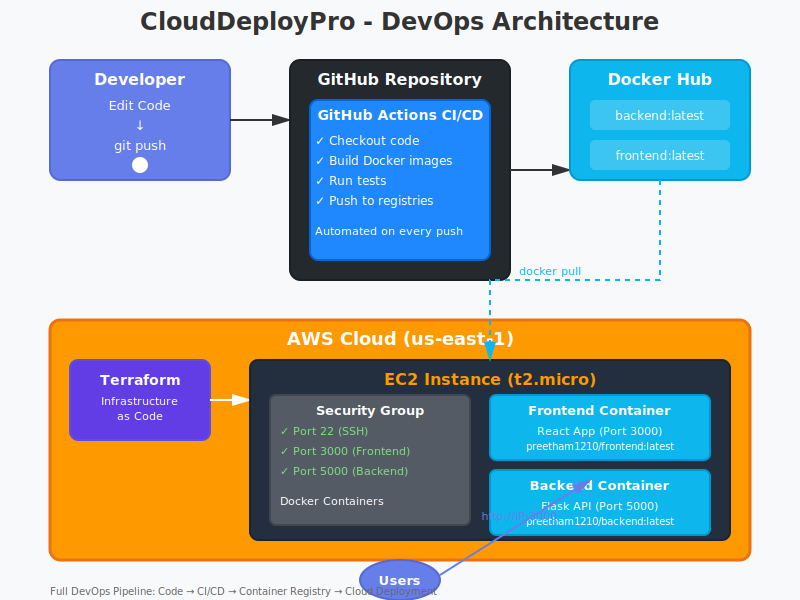

# CloudDeployPro - DevOps Portfolio Project


A full-stack task manager application demonstrating modern DevOps practices including containerization, CI/CD pipelines, and cloud deployment.

## 🚀 Project Overview

**CloudDeployPro** is a professional portfolio project showcasing end-to-end DevOps skills from development to deployment. Built with React and Flask, containerized with Docker, and designed for AWS deployment with Infrastructure as Code.

## 📐 Architecture



### System Components:

**Development Flow:**
1. Developer pushes code to GitHub
2. GitHub Actions CI/CD triggers automatically
3. Builds Docker images for frontend and backend
4. Pushes images to Docker Hub

**Infrastructure (AWS):**
- **Terraform:** Provisions infrastructure as code
- **EC2 Instance:** t2.micro (Free Tier eligible)
- **Security Groups:** Configured for ports 22, 3000, 5000
- **Docker Containers:** Frontend (React) and Backend (Flask)

**Deployment:**
- Images pulled from Docker Hub to EC2
- Containers orchestrated with Docker
- Publicly accessible via HTTP

### 🌐 **Live Deployment**

**This application has been successfully deployed to AWS and can be made available for live demonstration upon request.**

The deployment includes:
- ✅ AWS EC2 t2.micro instance (Free Tier eligible)
- ✅ Automated Docker container deployment
- ✅ Infrastructure provisioned via Terraform (Infrastructure as Code)
- ✅ Public accessibility with proper security group configuration

*Note: The AWS instance is currently stopped to conserve free-tier resources. It can be started within minutes for live demonstrations during interviews or portfolio reviews.*

**Deployment Architecture:**
- Frontend served on port 3000
- Backend API on port 5000
- Both applications running in Docker containers
- Fully automated deployment using Terraform

### Key Features
- ✅ Full-stack web application (React + Flask)
- ✅ RESTful API architecture
- ✅ Containerized with Docker
- ✅ Multi-container orchestration with Docker Compose
- 🔄 CI/CD pipeline 
- ☁️ AWS deployment 
- 📊 Monitoring & logging

## 🛠️ Tech Stack

### Frontend
- React.js
- Modern CSS with responsive design
- Fetch API for backend communication

### Backend
- Python Flask
- RESTful API
- CORS enabled for cross-origin requests

### DevOps
- Docker & Docker Compose
- GitHub for version control
- Docker Hub for image registry
- Terraform 
- GitHub Actions 
- AWS (EC2)

## 📁 Project Structure

```
CloudDeployPro-DevOps/
├── backend/
│   ├── app.py              # Flask API
│   ├── requirements.txt    # Python dependencies
│   ├── Dockerfile          # Backend container config
│   └── .dockerignore
├── frontend/
│   ├── src/
│   │   ├── App.js          # React main component
│   │   └── App.css         # Styling
│   ├── package.json        # Node dependencies
│   ├── Dockerfile          # Frontend container config
│   └── .dockerignore
├── docker-compose.yml      # Multi-container orchestration
├── terraform
├── .github
├── .gitignore
└── README.md
```

## 🐳 Docker Images

Public Docker images available on Docker Hub:
- **Backend**: `preetham1210/clouddeploypro-backend:latest`
- **Frontend**: `preetham1210/clouddeploypro-frontend:latest`

## 🚀 Quick Start

### Prerequisites
- Docker Desktop installed
- Docker Compose installed

### Run Locally with Docker Compose

1. Clone the repository:
```bash
git clone https://github.com/PreethamDesoden/CloudDeployPro-DevOps.git
cd CloudDeployPro-DevOps
```

2. Start the application:
```bash
docker-compose up -d
```

3. Access the application:
- Frontend: http://localhost:3000
- Backend API: http://localhost:5000

4. Stop the application:
```bash
docker-compose down
```

### Run Using Docker Images (No Build Required)

```bash
# Pull images
docker pull preetham1210/clouddeploypro-backend:latest
docker pull preetham1210/clouddeploypro-frontend:latest

# Run backend
docker run -d -p 5000:5000 --name backend preetham1210/clouddeploypro-backend:latest

# Run frontend
docker run -d -p 3000:3000 --name frontend preetham1210/clouddeploypro-frontend:latest
```

## 🚀 CI/CD Pipeline

This project features a complete automated CI/CD pipeline!

### Continuous Integration (Automatic)
Every push to `main` branch automatically:
- ✅ Builds Docker images
- ✅ Runs quality checks
- ✅ Pushes to Docker Hub

### Continuous Deployment (One-Click)
Deploy or stop your AWS infrastructure with a single click:

**To Deploy:**
1. Go to [Actions](https://github.com/PreethamDesoden/CloudDeployPro-DevOps/actions)
2. Select "Deploy to AWS"
3. Click "Run workflow" → Choose "deploy"
4. App goes live in 3-5 minutes!

**To Stop (Save Resources):**
1. Same workflow
2. Choose "stop" instead
3. EC2 instance stops automatically

**No manual AWS console work needed!**

### Pipeline Features
- 🔄 Automated builds on code changes
- 🐳 Docker image versioning
- ☁️ Infrastructure automation with Terraform
- 🔐 Secure credential management with GitHub Secrets
- 💰 Cost-controlled deployment (manual triggers)
- 📊 Full deployment visibility and logs

## 📡 API Endpoints

### Base URL: `http://localhost:5000`

| Method | Endpoint | Description |
|--------|----------|-------------|
| GET | `/` | Welcome message |
| GET | `/tasks` | Get all tasks |
| POST | `/tasks` | Create new task |

### Example Request
```bash
curl -X POST http://localhost:5000/tasks \
  -H "Content-Type: application/json" \
  -d '{"title": "New Task", "completed": false}'
```

## 🎯 Learning Objectives

This project demonstrates proficiency in:

1. **Full-Stack Development**
   - Building RESTful APIs
   - Creating responsive frontends
   - Client-server communication

2. **Containerization**
   - Writing efficient Dockerfiles
   - Multi-stage builds
   - Container orchestration

3. **DevOps Practices**
   - Version control with Git
   - Container registries
   - Infrastructure as Code 
   - CI/CD automation 

4. **Cloud Deployment**
   - AWS services 
   - Scalable architecture 
   - Monitoring & observability 

## 📋 Roadmap

- [x] Build full-stack application
- [x] Dockerize backend and frontend
- [x] Docker Compose setup
- [x] Push to Docker Hub
- [x] Write Terraform scripts for AWS infrastructure 
- [x] Deploy to AWS (EC2) 
- [x] Implement CI/CD with GitHub Actions 
- [x] Automated Docker builds on every push 
- [x] One-click deployment to AWS 
- [x] Automated instance management (start/stop) 
- [ ] Add monitoring with CloudWatch/Grafana (future enhancement)
- [ ] Set up automated testing (future enhancement)
- [ ] Add SSL/HTTPS (future enhancement)

## Output


## 👨‍💻 Author

**Preetham B**
- GitHub: [@PreethamDesoden](https://github.com/PreethamDesoden)
- LinkedIn: [Preetham-B](https://linkedin.com/in/preetham-b-)
- Email: preethamdesoden25983@gmail.com

## 📄 License

This project is open source and available under the MIT License.

## 🙏 Acknowledgments

Built as part of my journey to master Cloud and DevOps engineering, demonstrating practical skills for real-world deployment scenarios.

---

⭐ **Star this repo if you find it useful!**
